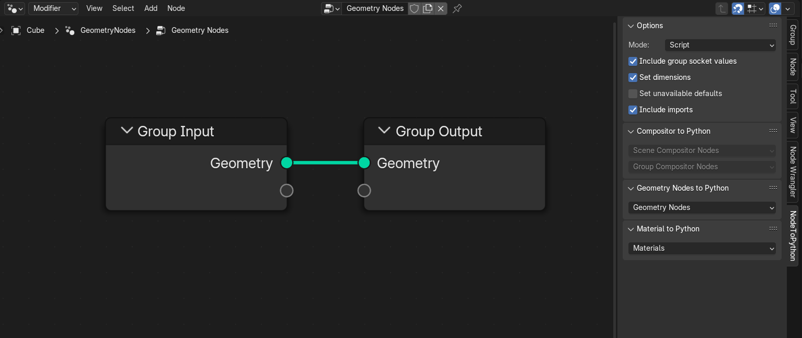

# Node to Python

   
 
## About
A Blender add-on to create scripts and add-ons! This add-on will take your Geometry Nodes, Materials, and Compositing nodes and convert them into legible Python code.

Node To Python automatically handles node layout, default values, subgroups, naming, colors, and more! 

Blender's node-based editors are powerful, yet accessible tools, and I wanted to make scripting them easier for add-on creators. Combining Python with node based setups allows you to do things that would otherwise be tedious or impossible, such as
* `for` loops
* creating different node trees for different versions or settings
* interfacing with other parts of the software or properties of an object

## Supported Versions
NodeToPython v3.3.1 is supported for Blender 3.0 - 4.3 on Windows, macOS, and Linux.

## Installation
### Blender Extensions Platform
NodeToPython is now on the official [Blender Extensions Platform](https://extensions.blender.org/add-ons/node-to-python/)! See https://extensions.blender.org/about/ for installation instructions and more info. 

### GitHub
1. Download the `NodeToPython.zip` file from the [latest release](https://github.com/BrendanParmer/NodeToPython/releases)
    * If you download other options, you'll need to rename the zip and the first folder to "NodeToPython" so Blender can properly import the add-on
2. In Blender, navigate to `Edit > Preferences > Add-ons`
3. Click Install, and find where you downloaded the zip file. Then hit the `Install Add-on` button, and you're done!

## Usage
Once you've installed the add-on, you'll see a new tab in any Node Editor's sidebar. You can open this with keyboard shortcut `N` when focused in the Node Editor.

In the tab, there are panels to create add-ons for Geometry Nodes, Materials, and Compositing Nodes, each with a drop-down menu. You can set options in the options tab.

In the options panel, select either **Script** or **Add-on**. 
* **Script** mode creates a function that generates the node tree and copies it to your Blender clipboard.
* **Add-on** mode generates a zip file for you in the save directory specified in the NodeToPython menu. From here, you can install it like a regular add-on. The generated add-on comes complete with operator registration and creating a modifier/material/scene for the node tree to be used in.
    * When exporting to an add-on in Blender 4.2 or higher, you'll need to select a GPL-compliant liscense for Blender to be able to register the extension.

## Bug Reports and Suggestions

When submitting an issue, please include 

* Your version of Blender (3.0 - 4.3)
    * Higher versions of Blender are expected to break NodeToPython. In general, work doesn't start on new versions until after the Beta stage of the release cycle
* Your operating system
* Steps to reproduce the issue or a description of what you were trying to accomplish. Providing a test blend file is especially helpful

Got suggestions? Please create an [issue](https://github.com/BrendanParmer/NodeToPython/issues)! I'm happy to hear what features people want

## Legal Disclaimer

**Important Notice:**

This tool is provided under the MIT license and is intended for lawful use only. It is your responsibility to ensure that any use of this tool complies with all applicable laws, including but not limited to copyright and intellectual property laws. The authors of this tool are not liable for any illegal use of this tool or any legal consequences that may arise from such use.

In particular, this tool generates code that requires the Blender Python API, which is licensed under the GNU General Public License (GPL). Code generated by this tool that incorporates or uses the Blender Python API must comply with the GPL requirements. For more details on the GPL, please see https://www.gnu.org/licenses/gpl-3.0.html. For more details on Blender's licensing, please see https://www.blender.org/about/license/

**Disclaimer**: The authors of this tool are not legal professionals. This notice is provided for informational purposes only and should not be construed as legal advice. For specific legal advice related to the use of this tool and compliance with the GPL or other legal matters, please consult a qualified attorney.

# Credits
See [CONTRIBUTORS.md](./CONTRIBUTORS.md) for all the people who've made this project possible
