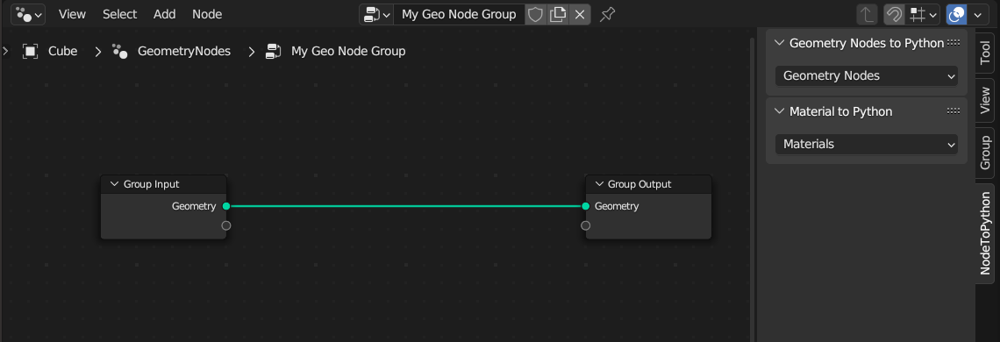

# Node to Python

  
 
## About
A Blender add-on to create scripts and add-ons! This add-on will take your Geometry Nodes or Materials and convert them into legible Python code.

Node To Python automatically handles node layout, default values, subgroups, naming, colors, and more! 

Blender's node-based editors are powerful, yet accessible tools, and I wanted to make scripting them easier for add-on creators. Combining Python with node based setups allows you to do things that would otherwise be tedious or impossible, such as
* `for` loops
* creating different node trees for different versions or settings
* interfacing with other parts of the software or properties of an object

## Supported Versions
NodeToPython v2.2 is compatible with Blender 3.0 - 3.6 on Windows, macOS, and Linux. I generally try to update the add-on to handle new nodes around the beta release of each update.

## Installation
1. Download the `NodeToPython.zip` file from the [latest release](https://github.com/BrendanParmer/NodeToPython/releases)
    * If you download other options, you'll need to rename the zip and the first folder to "NodeToPython" so Blender can properly import the add-on
2. In Blender, navigate to `Edit > Preferences > Add-ons`
3. Click Install, and find where you downloaded the zip file. Then hit the `Install Add-on` button, and you're done!

## Usage
Once you've installed the add-on, you'll see a new tab in any Node Editor's sidebar. You can open this with keyboard shortcut `N` when focused in the Node Editor.

In the tab, there's panels to create add-ons for Geometry Nodes and Materials, each with a drop-down menu. 

Select the node group you want code for, and you'll be prompted with a **Script** or **Add-on** option. 
* **Script** mode creates a function that generates the node tree and copies it to your Blender clipboard.
    * Doesn't include `import bpy` line
    * To keep NodeToPython cross-platform and independent of third-party libraries, to get it into your system clipboard you need to paste into the Blender text editor and recopy it currently
* **Add-on** mode generates a zip file for you in the save directory specified in the NodeToPython menu. From here, you can install it like a regular add-on. The generated add-on comes complete with operator registration and creating a modifier/material for the node tree to be used in. 

## Future
### v3.x
* Expansion to Compositing nodes
* New Blender 4.0 nodes and changes

### Later
* Better asset handling
* Auto-set handle movies and image sequences
* Automatically format code to be PEP8 compliant
* Automatically detect the minimum version of Blender needed to run the add-on

## Potential Issues
* As of version 2.2, the add-on will not set default values for
    * Scripts
    * IES files
    * Filepaths
    * UV maps
* This add-on doesn't currently set default values in Geometry Nodes modifiers, just the node groups themselves
* Currently when setting default values for the following, the add-on must be run in the same blend file as the node group was created in to set the default, otherwise it will just set it to `None`:
    * Materials
    * Objects
    * Collections
    * Textures

* In a future version, I plan on having the add-on adding all of the above to the Asset Library for reference
* You may run into naming conflicts if your add-on shares a name with another Blender add-on or operator (see [#56](https://github.com/BrendanParmer/NodeToPython/issues/56))

## Bug Reports and Suggestions

When submitting an issue, please include 

* Your version of Blender
* Your operating system
* A short description of what you were trying to accomplish, or steps to reproduce the issue.
* Sample blend files are more than welcome!

Got suggestions? Create an issue, happy to hear what features people want.
